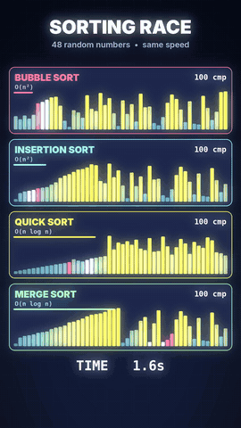
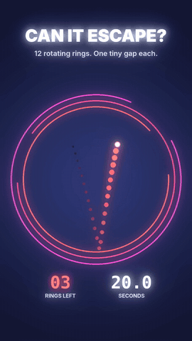
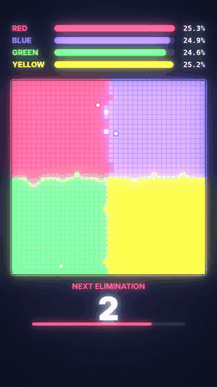

# 🐍 Pythonic Life — Shorts

Satisfying vertical animations for YouTube Shorts, generated **100% in Python**.
Every frame is drawn with NumPy, Pillow and OpenCV, and every sound is synthesized with NumPy. No video editor, no stock footage, no AI video models.

Code behind the **Pythonic Life** YouTube channel.

| Sorting Race | Can It Escape? | Color War |
|:---:|:---:|:---:|
|  |  |  |
| 4 sorting algorithms race on the same 48 numbers | A ball bounces through 12 spinning rings with one gap each | 4 colors fight for territory, and the smallest one is eliminated every 7 s |

## Quick start

```bash
git clone https://github.com/VALIJONY/pythonic-life-shorts.git
cd pythonic-life-shorts
pip install -r requirements.txt

# Linux (Ubuntu / Zorin / Debian): ffmpeg + fonts used by the renders
sudo apt install ffmpeg fonts-inter fonts-dejavu-core
```

Each script renders a 1080×1920 / 30 fps MP4 with audio into the current folder.

```bash
cd 01-sorting-race && python3 sort_race.py
cd 02-ring-escape  && python3 ring_escape.py 12     # seed = different run
cd 03-color-war    && python3 color_war.py 3        # seed = different winner
python3 color_war.py probe                          # list outcomes for 39 seeds
```

## The videos

### 01 — Sorting Race
Bubble, Insertion, Quick and Merge sort run in parallel at the same comparisons-per-frame speed.
Each comparison plays a tone pitched to the value being compared. The video ends with a results chart.

### 02 — Can It Escape?
A gravity-driven ball inside 12 counter-rotating rings. Each bounce plays the next note of a pentatonic melody.
Escaping a ring shatters it into particles. Change the seed and you get a completely different run.

### 03 — Color War
A pong-wars style territory battle with a battle-royale twist:
the smallest territory is eliminated every 7 seconds, survivors get an extra ball, and the final duel speeds up.
With seed `3`, RED wins by a single cell (473 vs 472).

## How it works

```
simulation (NumPy)  ──►  frames (Pillow + OpenCV glow)  ──►  ffmpeg stdin pipe  ──►  H.264
        │
        └──►  events  ──►  synthesized audio (NumPy)  ──►  WAV  ──►  muxed AAC
```

- Physics and game logic run first. Each frame records state plus events (bounces, flips, eliminations).
- Rendering is a pure function of that state, so the same seed always produces the same video.
- Glow comes from blurring a downscaled frame and adding it back on top.
- Audio is built by placing short synthesized tones on a sample buffer at the exact event times.

## License

MIT. Use it, remix it, make your own Shorts. A shout-out to Pythonic Life is appreciated 🙌
